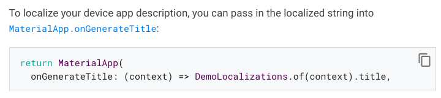
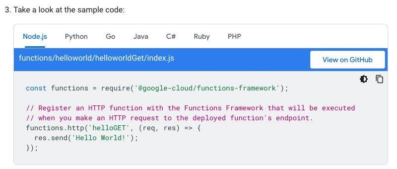
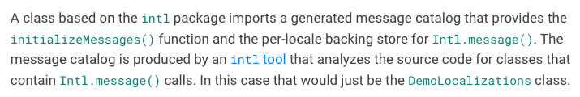
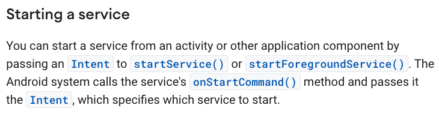
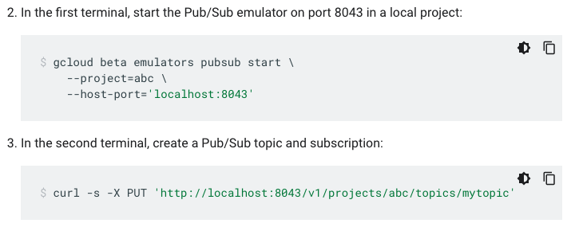
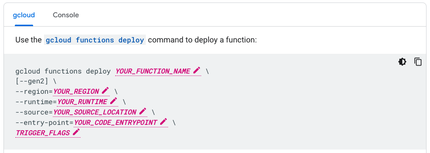
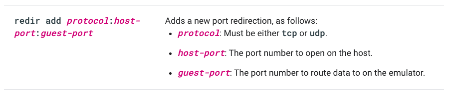
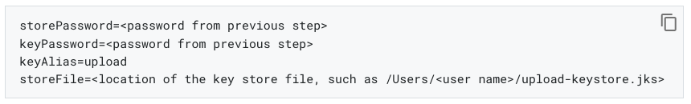

# ソースコードとコマンド

ソースコードのサンプルやコマンドの表記についての説明です。

ここでは一般的な表記について取り上げます。すでにプロジェクトや企業にガイドラインがある場合、そちらを優先してください。

## ソースコードのサンプル

サンプルは、通常テキストと違いが分かるような表示にします。例えばHTMLであれば`<pre>`です。

例1では灰色の長方形内にサンプルが書かれています。また例2では、プログラミング言語別にサンプルが表示されます。

**例1**

> 
>
> （引用元：[Flutter](https://docs.flutter.dev/development/accessibility-and-localization/internationalization)、2023-02-27閲覧）

**例2**

> 
>
> （引用元：[Google Cloud](https://cloud.google.com/functions/docs/tutorials/http)、2023-02-27閲覧）

## テキスト内のコード用フォント

通常テキスト内にクラス名、関数名、コマンド名などを記述する場合、通常テキストと見分けられるようコード用フォントを使います。

例3では緑色のフォント、例4ではボールドで枠に囲まれたフォントが使われています。

**例3**

> 
>
> （引用元：[Flutter](https://docs.flutter.dev/development/accessibility-and-localization/internationalization)、2023-02-27閲覧）

**例4**

> 
>
> （引用元：[Android Developers](https://developer.android.com/guide/components/services)、2023-02-27閲覧）

## コマンド

ソースコードのサンプルと同様、コマンドも通常テキストとの違いが分かるように記載します。例えばHTMLであれば`<pre>`です。

**例5**

> 
>
> （引用元：[Google Cloud](https://cloud.google.com/functions/docs/local-development)、2023-02-27閲覧）

## プレースホルダー

後で置き換えられる仮テキストをプレースホルダーと呼びます。例えばコマンドへの入力値です。

仮テキストであるため、他のテキストと明確に見分けられるようにする必要があります。本スタイルガイドでは特定の形式を定めませんが、プロジェクト内やドキュメント内で形式を統一しておく必要があります。以下に形式の例を挙げます。

次の例6では「YOUR_FUNCTION_NAME」と、単語を大文字で書いてアンダースコアで区切り、フォントをイタリックとボールドにしています。

**例6**

> 
>
> （引用元：[Google Cloud](https://cloud.google.com/functions/docs/deploy)、2023-02-27閲覧）

また、例7では「host-port」と、単語を小文字で書いてハイフンで区切り、フォントをイタリックとボールドにしています。

**例7**

> 
>
> （引用元：[Android Developers](https://developer.android.com/studio/run/emulator-console)、2023-02-27閲覧）

さらに、例8では「<password from previous step\>」と、単語を小文字で書いてスペースで区切り、山かっこで囲っています。

**例8**

> 
>
> （引用元：[Flutter](https://docs.flutter.dev/deployment/android)、2023-02-27閲覧）

## 関連資料

- Google developer documentation style guide
    - [Code in text](https://developers.google.com/style/code-in-text)
    - [Code samples](https://developers.google.com/style/code-samples)
    - [Document command-line syntax](https://developers.google.com/style/code-syntax)
    - [Format placeholders](https://developers.google.com/style/placeholders)
- Microsoft Style Guide
    - [Code examples](https://learn.microsoft.com/en-us/style-guide/developer-content/code-examples)
- Red Hat Technical Writing Style Guide
    - [3.4.4. Documenting Command Terminology and Syntax](https://stylepedia.net/style/6.0/#documenting-command-syntax)
- Apple Style Guide
    - [Intro to technical notation](https://support.apple.com/ja-jp/guide/applestyleguide/apsgf72184e0/web)